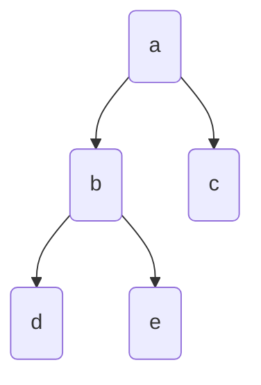
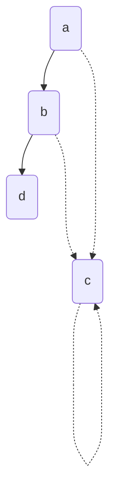
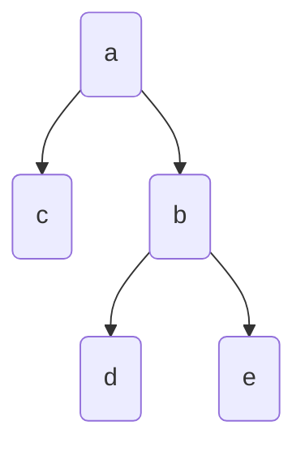
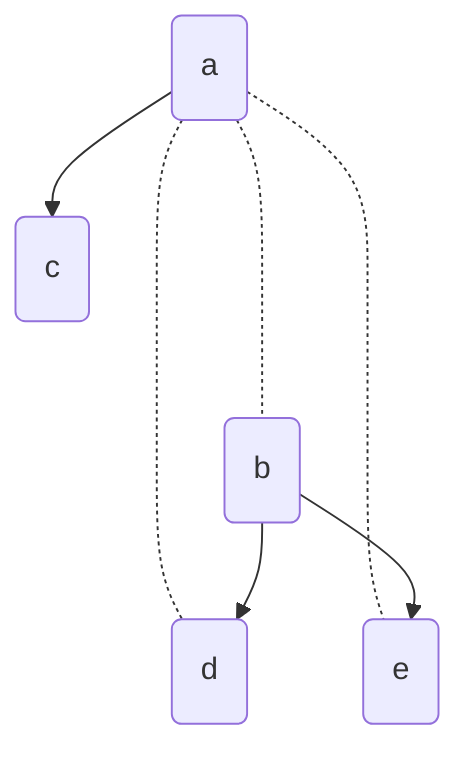
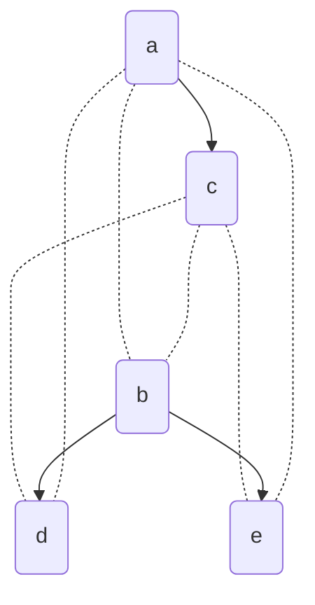

# 树形闭包表


### 引入
 在关系型数据库中描述树 —— 闭包表

> 掌握一个数据模型需要花费很多精力（想想关系数据建模有多少本书）。即便只使用一个数据模型，不用操心其内部工作机制，构建软件也是非常困难的。然而，因为数据模型对上层软件的功能（能做什么，不能做什么）有着至深的影响，所以选择一个适合的数据模型是非常重要的。
> ——DDIA

<!--more-->

  `树`这种数据结构在程序运行中十分常见，许多场景都挺适合在内存中构建一颗树去描述、解决问题（组织架构，目录，分类等等），那么在数据库这层上，如何舒服的存储和读取树形结构就会是一个问题。一般常见的会有两种存储方式：`关系型存储` 和 `文档存储`。两种方式各有优劣，还是得根据场景去选择合适的数据模型。

|                | 关系模型                                               | 文档模型                                                                   |
| -------------- | ------------------------------------------------------ | -------------------------------------------------------------------------- |
| **优势** | 事务支持好、更新和写入可以只修改要修改的数据           | 数据描述自然，查询一整课树快速方便；                                       |
| **劣势** | 给出一棵树需要不停查询、拼接，单条数据脏了会影响整颗树 | 局部更新和查询麻烦，需要拿到整棵树的信息，性能和潜在的并发问题，事务支持差 |

下面要描述的是关系型存储中的一种,闭包表存储。

``` sql
Table "t_tree_path" {
  "code" bigint [not null, default: "0", note: '前台类目code']
  "ancestor_code" bigint [not null, default: "0", note: '前台类目的祖先code']
  "level" int [not null, default: "1", note: 'code与其祖先code距离']
  Indexes {
    (code, ancestor_code) [unique, name: "code_parent"]
  }
}
```

上述是一个闭包表的常见存储结构,存储每个节点及其祖先节点,举个例子的话



那么此时表中数据，以d为例就是

| code | ancestor_code | level |
| ---- | ------------- | ----- |
| d    | d             | 1     |
| d    | b             | 2     |
| d    | a             | 3     |

而完整数据就会是

| code | ancestor_code | level |
| ---- | ------------- | ----- |
| a    | a             | 1     |
| b    | b             | 1     |
| b    | a             | 2     |
| c    | c             | 1     |
| c    | a             | 2     |
| d    | d             | 1     |
| d    | b             | 2     |
| d    | a             | 3     |
| e    | e             | 1     |
| e    | b             | 2     |
| e    | a             | 3     |

可以看到相对于只存储parent而言，这种存储方式会存储大量的祖先节点信息，但是后面会看到，在查询方面，可以相对于只存储parent，查询需要多次数据库请求与连接而言，使用这种方式，大部分操作可以在一次请求中完成。

### 查询子节点

要查询某的所有子节点，只需要

```sql
select * from t_tree_path as path
where path.ancestor_code = #{code}
```

在内存中在聚合

### 查询父路径

```sql
select * from t_tree_path as path
where path.code = #{code}
```

### 写入

```sql
INSERT INTO t_tree_path(code,parent,level) 
    SELECT #{code},t.ancestor_code,t.level+1 
    FROM t_tree_path AS t
    WHERE t.code= #{parent}
    UNION ALL
    SELECT #{code},#{code},1
```

写入一个节点，只需要加边即可  


若是要在b下加上c，需要加上虚线：所有祖先节点关联数据+自己的关联数据。

### 删除自身以及子树

```sql
DELETE FROM  t_tree_path 
WHERE code IN 
( SELECT code  
    FROM t_tree_path 
WHERE ancestor_code =#{code} )
```

1.查询所有a节点的子节点
2.删除以子节点code 为 code的所有闭包集，所以需要两次查询

优化写法
```sql
DELETE o FROM t_tree_path as o inner join
(
    SELECT m_code FROM t_tree_path WHERE m_ancestor_code = #{code}
) a on o.m_code = a.m_code
```

### 移动节点



把b转移到c下面

1. 断开部分关联数据



2. 关联新父级



第一步，先断开父级关系

```sql
DELETE 
FROM t_tree_path  
  WHERE ancestor_code IN (
    SELECT ancestor_code 
    FROM t_tree_path  
    WHERE code = #{originCode}
  and ancestor_code != #{originCode} 
  and code IN  (SELECT code FROM t_tree_path  WHERE ancestor_code = #{originCode}) 
) 
```

挑选满足特定条件的code，ancestor_code元祖  
1. code 是 originCode及其子集的code
2. parent 是 originCode的祖先节点（不包括originCode）

第二步，将子集关联

```sql
INSERT INTO t_tree_path (code,ancestor_code) 
SELECT 
    p.ancestor_code, 
    s.code 
FROM  t_tree_path  p 
CROSS JOIN t_tree_path  s 
WHERE p.code = #{targetCode} 
AND s.ancestor_code = #{originCode};
```

挑选满足条件的两个集合做笛卡尔乘积  
左:  祖先为原code的元祖中的 `code`  
右:  code为targetCode的祖先code  


### case

#### 场景1  
曾经在一个项目中使用过此结构来优化上下级关系，但数据是`外部的，只读的`，且通过`qmq消息同步`。  

在更新的时候，由于消息发送无序且消费过程中是并发的，导致两条相近create操作，因为下级先至，
上级后至，在更新这张辅助表时，没有正确插入，导致后续查询问题。  

之前不会出现问题是因为项目之前没有做一致性(父级code必须存在)的校验，无脑同步数据。  

虽然出现这个问题不是闭包表本身的问题，但是在使用时要考虑是否当前场景能否保证较的强一致性。
